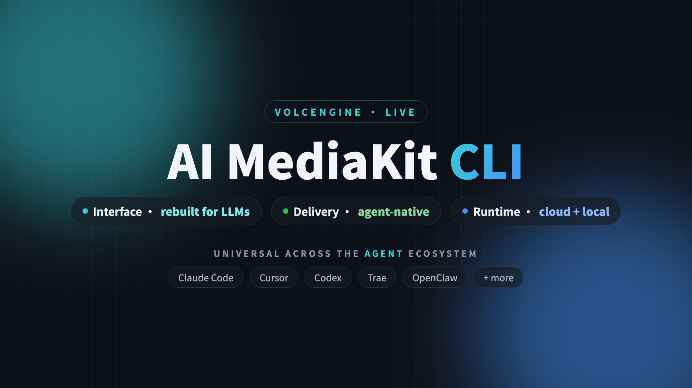

# AI MediaKit CLI

[简体中文](./README.zh.md)

<p align="center">
  
</p>

> The agent-native command-line toolkit for audio & video. Run Volcengine's cloud AI and local editing through **one unified command** — built to be driven by AI agents (Claude Code, Trae, Cursor …) or by you in the terminal.

`mediakit-cli` packs video enhancement, subtitle removal, and a full editing toolbox into a single tool. Heavy AI runs in the cloud; lightweight editing runs locally — switch with one flag, same command surface.

---

## ✨ What it can do

**40+ capabilities across 5 domains** — run `mediakit-cli --help-full` to list them all.

| Domain               | Capabilities                                                                                                                                                                                                     | Runs on            | Status       |
| -------------------- | ---------------------------------------------------------------------------------------------------------------------------------------------------------------------------------------------------------------- | ------------------ | ------------ |
| 🎬 **Editing** (17)  | trim · concat · watermark · subtitle · speed · volume · filter · flip · fade · mix · mux · extract audio · image-to-video                                                                                        | cloud **or** local | ✅ Available |
| 🎚️ **Audio** (2)     | voice / background separation · audio metadata probe                                                                                                                                                             | cloud              | ✅ Available |
| 🖼️ **Image AI** (5)  | enhance · object / text erase · quality scoring · OCR · background removal                                                                                                                                       | cloud              | ✅ Available |
| 🎥 **Video AI** (14) | enhancement (+ generative restore) · subtitle removal · ASR subtitles · OCR · highlight clipping (short-drama / mini-game) · storyline analysis · scene split · portrait & green-screen matting · metadata probe | cloud              | ✅ Available |
| 🔧 **Shared** (2)    | async task query · remote-file fetch                                                                                                                                                                             | local / cloud      | ✅ Available |
| 🚧 **Coming**        | video translation · commentary generation · anime restyling                                                                                                                                                      | cloud              | Rolling out  |

> AI capabilities run in the cloud (elastic compute, async). Editing runs **either** in the cloud **or** locally (sync, zero cost) — pick per command with `--cloud` / `--local`.

---

## 🚀 Quick Start

```bash
npm install -g @volcengine/mediakit-cli
npx skills add volcengine/mediakit-cli -g -y   # optional — install agent Skills (Claude Code / Trae / Cursor …)
export MEDIAKIT_API_KEY=<your-api-key>         # from the AI MediaKit console

# Cloud AI (async): enhance to 1080p, then poll for the result
mediakit-cli --cloud video enhance-video --video-url <url> --resolution 1080p
mediakit-cli shared query-task --task-id <task_id> --poll-complete

# Local editing (sync, no key needed): runs on your machine
mediakit-cli --local editing trim-video --video-url ./in.mp4 --start-time 3 --end-time 8
```

---

## 📦 Install

```bash
# One-click install (CLI + AI agent Skills)
npx @volcengine/mediakit-cli install -y

# npm only (CLI, recommended, cross-platform — pulls the right build for your OS / arch)
npm install -g @volcengine/mediakit-cli

# npx (no install)
npx @volcengine/mediakit-cli version

# curl (macOS / Linux)
curl -fsSL https://raw.githubusercontent.com/volcengine/mediakit-cli/main/scripts/install.sh | bash
```

Pin a version or path: `VERSION=<version> INSTALL_DIR="$HOME/.local/bin" curl -fsSL …/install.sh | bash`

Verify: `mediakit-cli doctor` (checks cloud readiness + local tool deps + install hints).

### Update

The CLI checks the npm registry for new releases once a day (TTL 24h). When an update is available you'll see a hint in `stderr` and a `_notice.update` field in the stdout JSON.

```bash
mediakit-cli version --check       # report current vs latest as JSON
mediakit-cli update --check        # check only, no install
mediakit-cli update                # install the latest via `npm install -g`
```

Suppress the check with `MEDIAKIT_DISABLE_UPDATE_CHECK=1` or in CI (`CI` env set).

---

## 🤖 Use with AI Agents

`mediakit-cli` ships **AI agent Skills** that teach an agent how to call it — so a user can just say _"enhance this video to 1080p and trim the best 5 seconds"_ and the agent orchestrates the commands.

```bash
# One command installs the Skills into every supported agent on your machine
npx skills add volcengine/mediakit-cli -g -y
```

This auto-detects and installs to **10+ runtimes** — Claude Code, Trae (CN & Global), Cursor, Codex, Gemini CLI, GitHub Copilot, OpenCode, OpenClaw, Antigravity, and more.

Every capability is also **MCP-compatible** — `mediakit-cli <domain> <tool> --schema` emits a JSON Schema for MCP / Anthropic Tool Use / function-calling, no hand-written adapter needed.

---

## 🧩 How it works

- **Two modes, one command surface.** `--cloud` runs heavy AI in Volcengine's cloud (elastic compute, async `task_id`); `--local` runs deterministic editing locally (sync, zero cloud cost). Default mode is `cloud-first`; per-command flags override it.
- **Command structure:** `mediakit-cli [--cloud|--local] <domain> <tool> [flags]` — domains are `editing` · `audio` · `image` · `video` · `shared`.
- **Outputs:** cloud results are returned as URLs; local results write to `~/.mediakit/temp` (override with `--output-path` or `MEDIAKIT_OUTPUT_PATH`).

---

## 📖 Documentation

- Volcengine AI MediaKit product docs & pricing: https://www.volcengine.com/docs/6448
- Full command reference & FAQ: see the docs site.
- [Error codes & exit code contract](./docs/error-codes.md) — stdout JSON protocol and exit-code rules.

---

## 🛠 Development

```bash
make build          # local build → .mediakit/build/dev/mediakit-cli
make build-all      # all platforms
make snapshot       # snapshot release
```

Releases are produced via `.goreleaser.yml`; npm distribution via `package.json` + `scripts/install.js`; curl install via `scripts/install.sh`.

<details>
<summary><b>Local Tool Admission</b> (FFmpeg policy)</summary>

- `ffmpeg` / `ffprobe`: required, `5.1.x`, `LGPL v2.1 or later`, commercial use allowed
- Optional FFmpeg features: `openh264`, `libmp3lame`, `libass`, `libfreetype`, `libfontconfig`, `libfribidi`, `libharfbuzz`, `zlib`, `libpng`, `libjpeg-turbo`
- Boundary: external process execution only (no static/dynamic linking of local tools into the Go binary); FFmpeg stays in LGPL mode by default; no `non-free` components; no local intermediate artifacts retained (only final outputs + `fetch-file` downloads).

</details>

---

## License

This project is open-sourced under the [MIT License](./LICENSE).

This software calls MediaKit APIs at runtime. Use of these APIs is subject to the following terms and privacy policies:

- [Video Cloud Service Special Terms](https://www.volcengine.com/docs/6448/79646?lang=zh)
- [Intelligent Processing Service Billing Rules](https://www.volcengine.com/docs/6448/104992?lang=zh)
- [Intelligent Processing Service Level Agreement](https://www.volcengine.com/docs/6448/79648?lang=zh)
