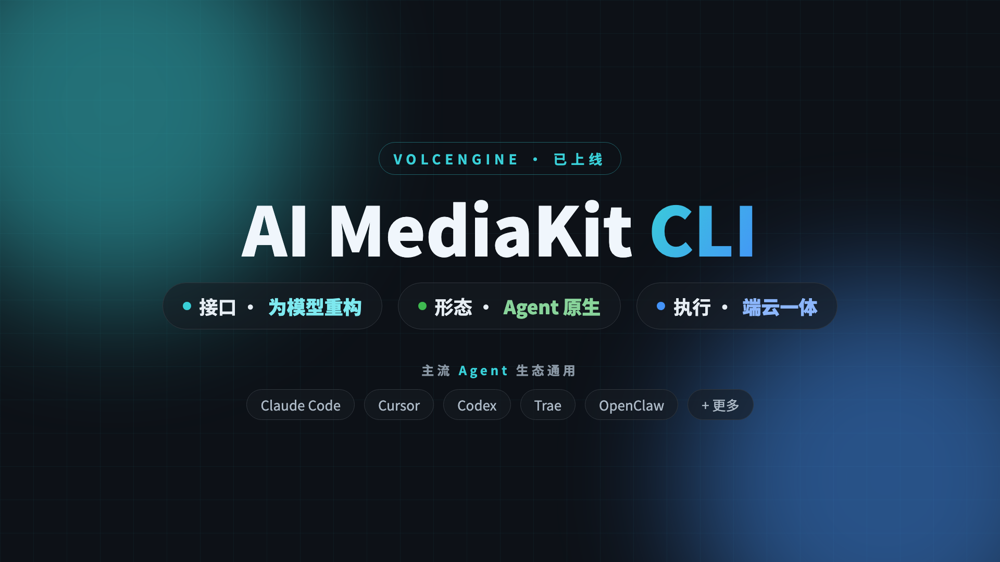

# AI MediaKit CLI

[English](./README.md)

<p align="center">
  
</p>

> 面向 Agent 的音视频命令行工具集。用**一个统一的命令**调用火山引擎的云端 AI 能力、跑本地剪辑——既能让 AI Agent（Claude Code、Trae、Cursor……）自然语言调度，也能你自己在终端直接用。

`mediakit-cli` 把画质增强、字幕擦除和一整套剪辑能力收进一个工具：重算力 AI 跑云端，轻量剪辑在本地跑——一个 flag 切换，命令写法不变。

---

## ✨ 能做什么

| 能力                                                                                              | 运行             | 状态        |
| ------------------------------------------------------------------------------------------------- | ---------------- | ----------- |
| **AI 能力** — 画质增强 · 字幕擦除                                                                 | 云端             | ✅ 已上线   |
| **剪辑能力**（11 个）— 裁剪 · 拼接 · 加水印 · 加字幕 · 调速 · 翻转 · 提取 / 合成音频 · 图片转视频 | 云端 **或** 本地 | ✅ 已上线   |
| **更多 AI 工作流** — 视频理解 · 视频翻译 · 高光智剪 · 剧本还原 · 解说 · 漫剧转绘 …                | 云端             | 🚧 陆续上线 |

> AI 能力跑在云端（弹性算力、异步）；剪辑能力**云端或本地**皆可（本地跑，同步、零成本）—— 每条命令用 `--cloud` / `--local` 选。

---

## 🚀 快速开始

```bash
npm install -g @volcengine/mediakit-cli
npx skills add volcengine/mediakit-cli -g -y   # 可选 —— 装 Agent Skill（Claude Code / Trae / Cursor …）
export MEDIAKIT_API_KEY=<你的 API Key>         # 在 AI MediaKit 控制台获取

# 云端 AI（异步）：增强到 1080p，再轮询拿结果
mediakit-cli --cloud video enhance-video --video-url <url> --resolution 1080p
mediakit-cli shared query-task --task-id <task_id> --poll-complete

# 本地剪辑（同步、无需 Key）：在本机跑
mediakit-cli --local editing trim-video --video-url ./in.mp4 --start-time 3 --end-time 8
```

---

## 📦 安装

```bash
# npm（推荐，跨平台——自动拉取对应平台 / 架构的构建产物）
npm install -g @volcengine/mediakit-cli

# npx（免安装）
npx @volcengine/mediakit-cli version

# curl（macOS / Linux）
curl -fsSL https://raw.githubusercontent.com/volcengine/mediakit-cli/main/scripts/install.sh | bash
```

指定版本 / 路径：`VERSION=<version> INSTALL_DIR="$HOME/.local/bin" curl -fsSL …/install.sh | bash`

验证环境：`mediakit-cli doctor`（检查云端就绪 + 本地工具依赖 + 安装指引）。

---

## 🤖 配合 AI Agent 使用

`mediakit-cli` 自带 **AI Agent Skill**——教 Agent 怎么调它。于是用户只需说一句*“把这个视频增强到 1080p，再剪出最精彩的 5 秒”*，Agent 就能自动编排命令。

```bash
# 一个命令把 Skill 装进本机所有支持的 Agent
npx skills add volcengine/mediakit-cli -g -y
```

它会自动检测并安装到 **10+ 种 runtime**——Claude Code、Trae（国内 & 海外）、Cursor、Codex、Gemini CLI、GitHub Copilot、OpenCode、OpenClaw、Antigravity 等。

每个能力还**MCP 兼容**——`mediakit-cli <domain> <tool> --schema` 吐出 JSON Schema，直接喂 MCP / Anthropic Tool Use / function calling，无需手写适配器。

---

## 🧩 工作原理

- **两种模式，同一套命令。** `--cloud` 把重算力 AI 跑在火山引擎云端（弹性算力、异步 `task_id`）；`--local` 在本机跑确定性剪辑（同步、零云端成本）。默认 `cloud-first`，单命令 flag 可覆盖。
- **命令结构：** `mediakit-cli [--cloud|--local] <domain> <tool> [flags]`——domain 为 `editing` · `video` · `shared`。
- **输出：** 云端结果以 URL 返回；本地结果写到 `~/.mediakit/temp`（可用 `--output-path` 或 `MEDIAKIT_OUTPUT_PATH` 覆盖）。

---

## 📖 文档

- Volcengine AI MediaKit 产品文档 & 定价：https://www.volcengine.com/docs/6448
- 完整命令参考 & FAQ：见文档站。

---

## 🛠 开发

```bash
make build          # 本地构建 → .mediakit/build/dev/mediakit-cli
make build-all      # 全平台
make snapshot       # snapshot release
```

发布走 `.goreleaser.yml`；npm 分发走 `package.json` + `scripts/install.js`；curl 安装走 `scripts/install.sh`。

<details>
<summary><b>本地工具 Admission</b>（FFmpeg 策略）</summary>

- `ffmpeg` / `ffprobe`：必需，`5.1.x`，`LGPL v2.1 或更高`，允许商用
- 可选 FFmpeg 能力：`openh264`、`libmp3lame`、`libass`、`libfreetype`、`libfontconfig`、`libfribidi`、`libharfbuzz`、`zlib`、`libpng`、`libjpeg-turbo`
- 边界：仅通过外部进程调用（不把本地工具静态 / 动态链接进 Go 二进制）；FFmpeg 默认保持 LGPL 模式；默认不引入 `non-free` 组件；不保留本地中间产物（仅保留最终产物 + `fetch-file` 下载）。

</details>

---

## License

本项目基于 [MIT 许可证](./LICENSE) 开源。

该软件运行时会调用 MediaKit 的 API，使用这些 API 需要遵守如下协议和隐私政策：

- [视频云服务专用条款](https://www.volcengine.com/docs/6448/79646?lang=zh)
- [智能处理服务计费结算规则](https://www.volcengine.com/docs/6448/104992?lang=zh)
- [智能处理服务等级协议](https://www.volcengine.com/docs/6448/79648?lang=zh)
